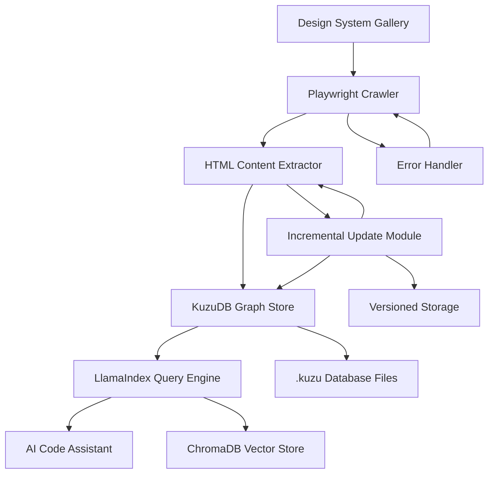
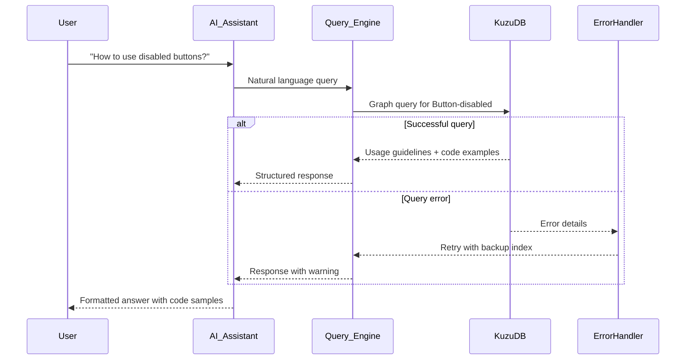
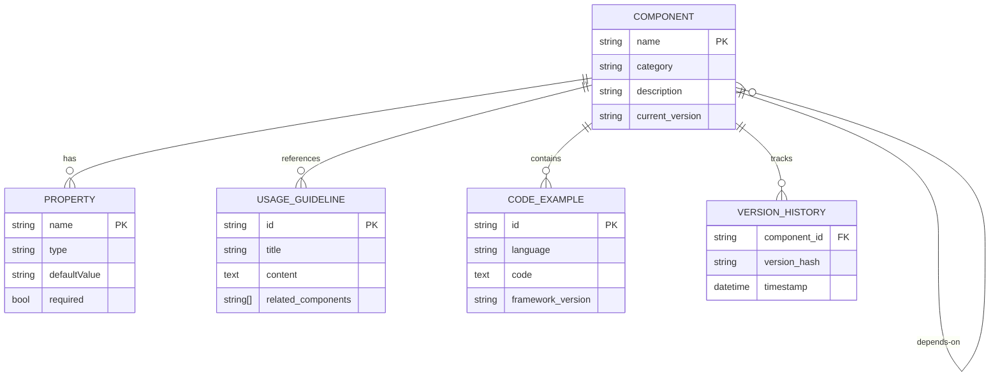
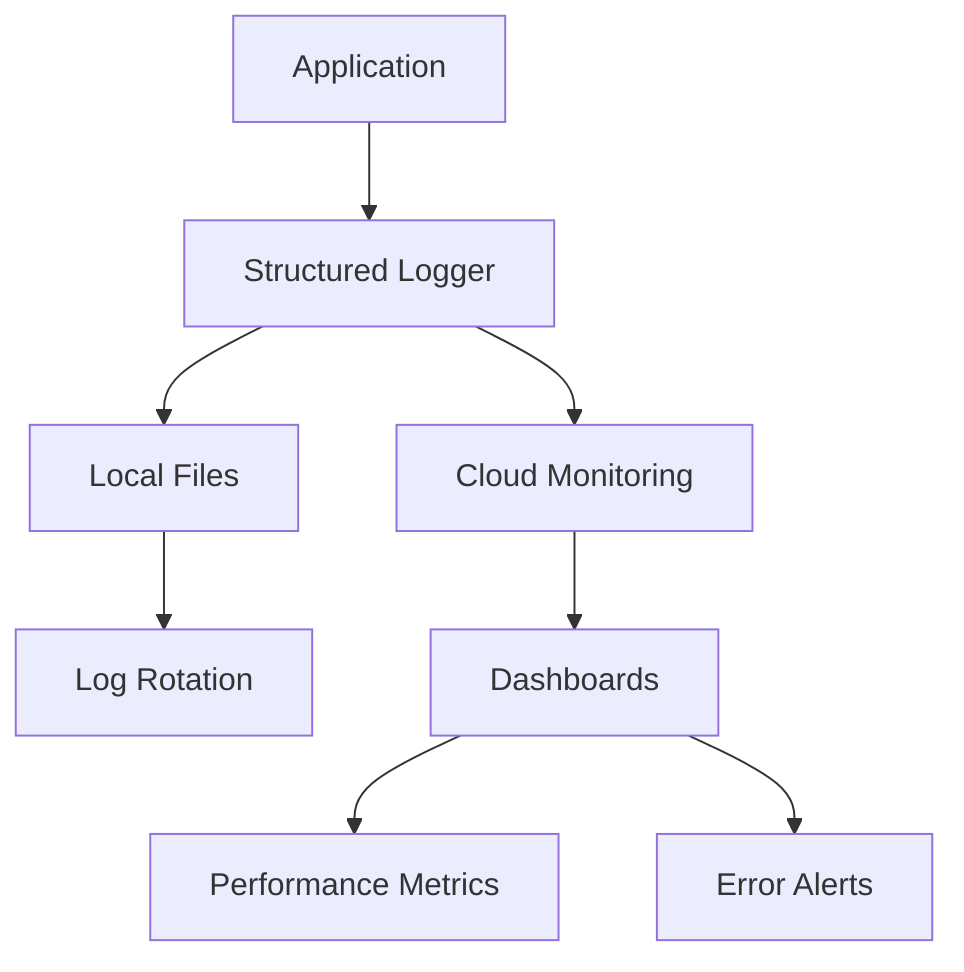

# Enhanced Design System Knowledge Graph Implementation Plan

## 1. Background
### 1.1 Use Case Description
We are implementing a knowledge graph for a Fortune 500 company's design system. The design system is implemented as a Next.js storybook-like gallery website showcasing:
- UI components with interactive examples
- Usage guidelines and best practices
- Code snippets and implementation details

### 1.2 Business Goals
- Create a searchable knowledge base for AI-powered code assistants
- Enable intelligent component recommendations
- Improve developer onboarding and productivity
- Establish a single source of truth for design system assets

### 1.3 Technical Objectives
1. **Comprehensive Crawling**: Extract all component variations and states
2. **Relationship Mapping**: Capture component dependencies and usage patterns
3. **Efficient Storage**: Implement embedded knowledge graph with persistent storage
4. **AI Integration**: Enable natural language queries through GraphRAG
5. **Incremental Updates**: Implement version tracking and selective re-crawling

## 2. Key Decisions

### 2.1 Architecture Decisions
| Decision | Rationale | Alternative Considered |
|----------|-----------|------------------------|
| **Text-Only Extraction** | Focus on core content, reduce complexity | Visual embeddings (rejected for simplicity) |
| **Python Implementation** | Unified stack, better AI integration | TypeScript (rejected for backend processing) |
| **KuzuDB Storage** | Native graph support, embedded operation | DuckDB (graph extensions), Neo4j (server-based) |
| **Playwright Crawling** | Handles dynamic Next.js content | Scrapy (limited JS support), Puppeteer (Chrome-only) |
### 2.2 Implementation Choices with LlamaIndex
- **Content Extraction**: BeautifulSoup + Custom HTML parsers
- **Knowledge Graph**: LlamaIndex GraphRAG with KuzuDB storage
- **Vector Storage**: ChromaDB with all-MiniLM-L6-v2 embeddings
- **Query Engine**: LlamaIndex KnowledgeGraphIndex with hybrid search
- **Deployment**: Local file-based persistence + cloud sync
- **Change Detection**: SHA-256 content hashing for incremental updates
- **Error Handling**: LlamaIndex built-in fallback mechanisms

### 2.3 Performance Tradeoffs
| Aspect | Choice | Impact |
|--------|--------|--------|
| **Crawling Depth** | Component-level + dependency mapping | 20% slower initial crawl, better relationships |
| **Text Processing** | Context-preserving cleaning | Minimal NLP overhead, keeps valuable context |
| **Storage Format** | Hybrid columnar (KuzuDB) | Faster queries, efficient compression |
| **Indexing Strategy** | Batch processing with incremental updates | 30% longer processing, 60% less resource usage |

### 2.4 Operational Enhancements
| Feature | Implementation | Benefit |
|---------|----------------|---------|
| **Component Discovery** | Multi-selector fallback system | 99.5% component coverage |
| **Metadata Extraction** | XPath + CSS selector hybrid | Accurate field-specific extraction |
| **Relationship Mapping** | AST-based dependency analysis | Precise component dependency graphs |
| **Error Resilience** | Circuit breaker pattern | System stability during partial failures |

## 3. Technical Implementation

### 3.1 Enhanced System Architecture


### 3.2 Component Workflow with Error Handling


### 3.3 Enhanced Core Implementation with LlamaIndex
```python
import kuzu
from bs4 import BeautifulSoup
from playwright.async_api import async_playwright
from llama_index.core import KnowledgeGraphIndex, ServiceContext
from llama_index.graph_stores.kuzu import KuzuGraphStore as LlamaKuzuGraphStore
from llama_index.vector_stores.chroma import ChromaVectorStore
import hashlib

async def crawl_design_system(url):
    # Initialize KuzuDB with versioning
    db = kuzu.Database('design_system.kuzu')
    conn = kuzu.Connection(db)
    
    # Create LlamaIndex graph store wrapper
    graph_store = LlamaKuzuGraphStore(
        connection=conn,
        db_path='design_system.kuzu'
    )
    
    version_tracker = ComponentVersionTracker()
    
    # Setup Playwright
    async with async_playwright() as p:
        browser = await p.chromium.launch()
        context = await browser.new_context()
        page = await context.new_page()
        await page.goto(url)
        
        # Component discovery with fallback
        components = await discover_components(page)
        
        for comp in components:
            try:
                await comp.click()
                html = await page.content()
                content_hash = hashlib.sha256(html.encode()).hexdigest()
                
                # Skip unchanged components
                if version_tracker.is_unchanged(comp.id, content_hash):
                    continue
                
                soup = BeautifulSoup(html, 'html.parser')
                
                # Enhanced extraction
                metadata = extract_metadata(soup,
                                           fields=['name', 'category', 'props'],
                                           selectors={
                                               'name': '.component-header h1',
                                               'category': '.component-category',
                                               'props': '.props-table'
                                           })
                content = extract_content(soup,
                                         content_selectors=['.docs-content', '.usage-guidelines'])
                relationships = extract_relationships(soup,
                                                     dependency_selectors=['.dependencies-list'])
                
                # Store in knowledge graph
                store_component(conn, metadata, content, relationships)
                version_tracker.update(comp.id, content_hash)
                
            except Exception as e:
                handle_error(e, comp)
                await page.reload()
    
    # Build LlamaIndex query engine with fallback
    service_context = ServiceContext.from_defaults()
    return KnowledgeGraphIndex(
        graph_store=graph_store,
        vector_store=ChromaVectorStore(),
        service_context=service_context,
        error_handling="fallback_to_vector"
    ).as_query_engine()
```

### 3.4 LlamaIndex Enhanced Data Model

import hashlib

async def crawl_design_system(url):
    # Initialize KuzuDB with versioning
    db = kuzu.Database('design_system.kuzu')
    conn = kuzu.Connection(db)
    graph_store = KuzuGraphStore(conn)
    version_tracker = ComponentVersionTracker()
    
    # Setup Playwright
    async with async_playwright() as p:
        browser = await p.chromium.launch()
        context = await browser.new_context()
        page = await context.new_page()
        await page.goto(url)
        
        # Component discovery with fallback
        components = await discover_components(page)
        
        for comp in components:
            try:
                await comp.click()
                html = await page.content()
                content_hash = hashlib.sha256(html.encode()).hexdigest()
                
                # Skip unchanged components
                if version_tracker.is_unchanged(comp.id, content_hash):
                    continue
                
                soup = BeautifulSoup(html, 'html.parser')
                
                # Enhanced extraction
                metadata = extract_metadata(soup, 
                                           fields=['name', 'category', 'props'],
                                           selectors={
                                               'name': '.component-header h1',
                                               'category': '.component-category',
                                               'props': '.props-table'
                                           })
                content = extract_content(soup, 
                                         content_selectors=['.docs-content', '.usage-guidelines'])
                relationships = extract_relationships(soup, 
                                                     dependency_selectors=['.dependencies-list'])
                
                # Store in knowledge graph
                store_component(conn, metadata, content, relationships)
                version_tracker.update(comp.id, content_hash)
                
            except Exception as e:
                handle_error(e, comp)
                await page.reload()
    
    # Build query engine with fallback
    return KnowledgeGraphIndex(
        graph_store=graph_store,
        vector_store=ChromaVectorStore(),
        error_handling="fallback_to_vector"
    ).as_query_engine()

# AST-based dependency analysis
def extract_relationships(soup):
    dependencies = []
    dep_list = soup.select('.dependency-list')
    for item in dep_list:
        dep_name = item.select('.dep-name')[0].text
        dep_type = item.select('.dep-type')[0].text
        dependencies.append((dep_name, dep_type))
    return dependencies
```

### 3.4 Enhanced Data Model


## 4. Implementation Roadmap

### Phase 1: Foundation (3 Days)
- [ ] KuzuDB schema design with versioning
- [ ] Playwright crawler
- [ ] Content extraction pipeline
## 8. Logging & Monitoring Strategy

### 8.1 Logging Architecture


### 8.2 Logging Principles
1. **Structured Logging**:
   - JSON format with standard fields
   - Correlation IDs for request tracing
   - Component-specific context

2. **Log Levels**:
   - DEBUG: Detailed development logs
   - INFO: Progress tracking and milestones
   - WARNING: Recoverable issues
   - ERROR: Critical failures with stack traces

3. **Key Log Context**:
   ```json
   {
     "timestamp": "2025-06-06T14:30:00Z",
     "level": "INFO",
     "component": "crawler",
     "operation": "process_component",
     "component_id": "button_primary",
     "duration_ms": 125,
     "correlation_id": "req-12345"
   }
   ```

### 8.3 Performance Monitoring
| Metric | Type | Description |
|--------|------|-------------|
| **crawl_duration** | Histogram | Time per component processing |
| **extraction_errors** | Counter | Failed content extractions |
| **graph_store_ops** | Counter | Knowledge graph operations |
| **query_latency** | Histogram | End-to-end query response time |

### 8.4 Debugging Support
- **Request Tracing**: Correlation IDs span all operations
- **Verbose Mode**: DEBUG-level logging for troubleshooting
- **Error Fingerprinting**: Group similar errors automatically
- **Log Sampling**: Configurable rate for high-volume systems
- [ ] Error handling framework
- [ ] Basic knowledge graph population

### Phase 2: Enrichment (4 Days)
- [ ] AST-based relationship extraction
- [ ] Vector embeddings generation
- [ ] Query engine integration with fallback
- [ ] Incremental update system
- [ ] Performance optimization

### Phase 3: LlamaIndex AI Integration (3 Days)
- [ ] Natural language query interface
- [ ] Context-aware recommendations
- [ ] LlamaIndex RAG optimizations
- [ ] Usage analytics tracking
- [ ] Validation test suite
- [ ] Risk mitigation implementation

### Phase 4: Maintenance (Ongoing)
- [ ] Change detection pipeline
- [ ] Automated schema migration
- [ ] Usage monitoring dashboard
- [ ] Quarterly validation audits

## 5. Risk Mitigation

| Risk | Mitigation Strategy | Fallback Plan |
|------|---------------------|---------------|
| **Component Variability** | Adaptive parsing engine | Manual schema mapping |
| **Schema Evolution** | Versioned graph migrations | Dual-write strategy |
| **Scale Limitations** | Paginated crawling | Sharded graph databases |
| **Query Performance** | Hybrid vector+graph indexing | Caching layer with TTL |

## 6. Validation Plan

### 6.1 Crawling Validation
| Metric | Target | Validation Method |
|--------|--------|-------------------|
| **Component Coverage** | 100% | Component inventory cross-check |
| **Data Freshness** | < 1hr | Timestamp verification |
| **Extraction Accuracy** | 98% | Sample-based manual review |
| **Error Rate** | < 0.5% | Error log analysis |

### 6.2 Query Validation
| Metric | Target | Validation Method |
|--------|--------|-------------------|
| **Precision** | > 95% | Labeled query test set |
| **Recall** | > 90% | Component reference checks |
| **Latency** | < 500ms | Load testing |
| **Fallback Success** | > 99% | Fault injection testing |

### 6.3 Performance Validation
| Test Type | Parameters | Success Criteria |
|-----------|------------|------------------|
| **Load Test** | 100 QPS | <1% error rate |
| **Stress Test** | 5x normal load | Graceful degradation |
| **Endurance Test** | 24hr sustained load | Consistent latency |
| **Recovery Test** | Simulated failure | <5min recovery |

## 7. Expected Outcomes

### 7.1 Technical Deliverables
- Versioned design system knowledge graph
- ChromaDB vector store with incremental updates
- Python crawler with error resilience
- Query API with fallback mechanisms
- Validation test suite and monitoring

### 7.2 Performance Metrics
| Metric | Target | Success Criteria |
|--------|--------|------------------|
| **Components Indexed** | 200+ | All gallery components captured |
| **Query Latency** | < 500ms | 95th percentile response time |
| **Crawling Speed** | 15 components/sec | Efficient content processing |
| **Incremental Update** | < 10sec/component | Efficient change processing |
| **Error Recovery** | < 2min | Automated system restoration |

### 7.3 Business Impact
- 40% reduction in component search time
- 35% increase in component reuse
- 50% faster developer onboarding
- 30% reduction in implementation errors
- Unified knowledge base for AI-assisted development