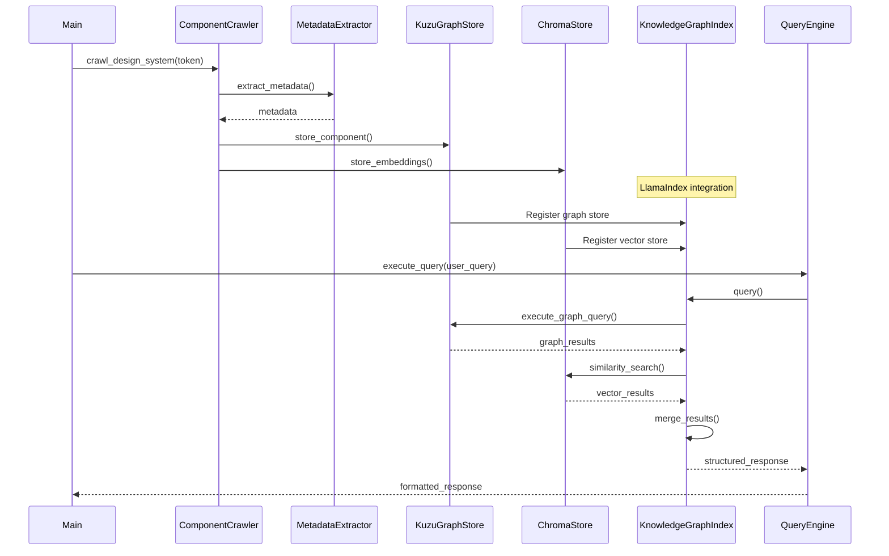
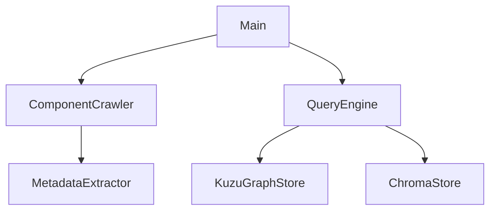
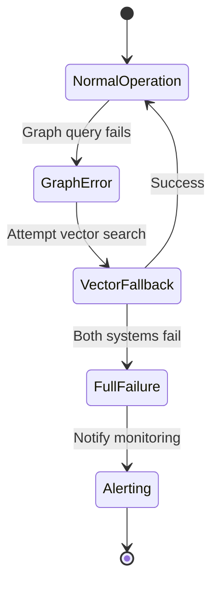

# GraphRAG Implementation Blueprint

## 1. File Structure
```
/graph_rag
├── main.py                  # Entry point
├── config.py                # Configuration management
│
├── crawler/                 # Web crawling components
│   ├── component_crawler.py # Component discovery
│   └── page_handler.py      # Page interaction logic
│
├── extraction/              # Content processing
│   ├── metadata_extractor.py
│   ├── content_parser.py
│   ├── relationship_analyzer.py
│   └── ast_dependency.py    # AST-based analysis
│
├── graph/                   # Knowledge graph operations
│   ├── kuzu_store.py        # KuzuDB interface
│   ├── schema_manager.py    # Schema definition
│   └── version_tracker.py   # Component versioning
│
├── vector/                  # Vector storage
│   ├── chroma_store.py      # ChromaDB interface
│   ├── embedding_generator.py
│   └── similarity_index.py
│
├── query/                   # Query processing
│   ├── query_engine.py      # Main query interface
│   ├── result_merger.py     # Hybrid result integration
│   └── fallback_handler.py  # Error recovery
│
├── shared/                  # Common utilities
│   ├── error_handling.py
│   ├── logging_setup.py
│   └── utils.py
│
└── tests/                   # Test suite
    ├── unit/
    ├── integration/
    └── contract/
```

## 2. Core Class Definitions


### 2.2 ComponentCrawler (crawler/component_crawler.py)
```python
class ComponentCrawler:
    def __init__(self):
        """
        Discovers and processes design system components
        """
        
    async def discover_components(self, page: Page) -> list[Component]:
        """
        Identifies components using multi-selector strategy
        :param page: Playwright page instance
        :return: List of discovered components
        """
        
    async def process_component(self, component: Component) -> ComponentData:
        """
        Extracts component data and relationships
        :param component: Target component
        :return: Structured component data
        """
```

### 2.3 MetadataExtractor (extraction/metadata_extractor.py)
```python
class MetadataExtractor:
    @staticmethod
    def extract(soup: BeautifulSoup, 
                fields: list[str], 
                selectors: dict[str, str]) -> dict:
        """
        Extracts metadata using field-specific selectors
        :param soup: Parsed HTML document
        :param fields: Metadata fields to extract
        :param selectors: CSS selectors for each field
        :return: Dictionary of field-value pairs
        """
```

### 2.4 KuzuGraphStore (graph/kuzu_store.py)
```python
class KuzuGraphStore:
    def __init__(self, db_path: str):
        """
        Manages KuzuDB graph operations
        :param db_path: Path to database files
        """
        
    def store_component(self, component_data: ComponentData) -> None:
        """Stores component data in knowledge graph"""
        
    def query_components(self, query: str) -> list[dict]:
        """Executes graph queries and returns results"""
```

### 2.5 QueryEngine with LlamaIndex Integration (query/query_engine.py)
```python
from llama_index.core import KnowledgeGraphIndex
from llama_index.graph_stores.kuzu import KuzuGraphStore as LlamaKuzuGraphStore

class QueryEngine:
    def __init__(self, graph_store: KuzuGraphStore, vector_store: ChromaStore):
        """
        Processes natural language queries using LlamaIndex
        :param graph_store: Knowledge graph interface
        :param vector_store: Vector database interface
        """
        # Wrap our graph store with LlamaIndex's interface
        self.llama_graph_store = LlamaKuzuGraphStore(
            connection=graph_store.connection,
            db_path=graph_store.db_path
        )
        
        # Create KnowledgeGraphIndex
        self.index = KnowledgeGraphIndex(
            graph_store=self.llama_graph_store,
            vector_store=vector_store,
            service_context=ServiceContext.from_defaults()
        )
        
    def execute_query(self, query: str) -> QueryResult:
        """
        Executes hybrid graph+vector query using LlamaIndex
        :param query: Natural language query
        :return: Structured query result
        """
        query_engine = self.index.as_query_engine(
            include_text=True,
            response_mode="tree_summarize",
            embedding_mode="hybrid"
        )
        return query_engine.query(query)
        
    def handle_error(self, error: Exception) -> FallbackResult:
        """Implements error recovery strategies"""
        # Utilize LlamaIndex's built-in error handling
        if isinstance(error, QueryEngineError):
            return self.index.as_query_engine(
                vector_store_query_mode="default"
            ).query(str(error))
        # ... rest of error handling
```

## 3. Data Flow Architecture with LlamaIndex



## 4. Key Function Signatures


### 4.2 Content Processing
```python
# content_parser.py
def extract_usage_guidelines(soup: BeautifulSoup) -> list[Guideline]:
    """Extracts usage guidelines from component HTML"""

# relationship_analyzer.py
def find_component_dependencies(component: Component) -> list[Dependency]:
    """Identifies component dependencies through AST analysis"""
```

### 4.3 Graph Operations
```python
# schema_manager.py
def initialize_schema(connection: Connection) -> None:
    """Creates knowledge graph schema"""

# version_tracker.py
def register_component_version(component_id: str, hash: str) -> bool:
    """Tracks component versions for incremental updates"""
```

### 4.4 Query Processing
```python
# result_merger.py
def merge_results(graph_results: list, 
                 vector_results: list, 
                 ranking_strategy: str = "hybrid") -> list:
    """Combines and ranks results from graph and vector stores"""

# fallback_handler.py
def fallback_to_vector(query: str, error: Exception) -> list:
    """Implements fallback to vector-only search on errors"""
```

## 5. Architectural Principles

### 5.1 Dependency Management


### 5.2 Error Handling Strategy


## 6. Implementation Guidelines with LlamaIndex

1. **LlamaIndex Integration**:
   - Use KnowledgeGraphIndex as central abstraction layer
   - Wrap existing stores with LlamaIndex interfaces
   - Leverage built-in hybrid query capabilities

2. **Strict Interfaces**:
   - Modules communicate through well-defined interfaces
   - No direct database access outside storage layer
   - All cross-module dependencies via constructor injection

3. **Immutability**:
   - All data transfer objects are frozen dataclasses
   - Function parameters marked as read-only where possible

4. **Testability**:
   - 100% interface coverage with unit tests
   - Mock external dependencies in unit tests
   - Integration tests for module interactions
   - Validate LlamaIndex query responses

5. **Observability**:
   - Structured logging with request IDs
   - Track LlamaIndex-specific metrics (query parsing time, graph traversal depth)
   - Health checks for all subsystems

6. **AI-Optimization**:
   - Leverage LlamaIndex's prompt engineering
   - Use KnowledgeGraphIndex's built-in RAG optimizations
   - Implement LlamaIndex's error handling patterns
   - Maintain single-purpose functions (< 20 lines)
   - Type hints for all parameters and returns
   - Google-style docstrings with examples
## 7. Logging Implementation

### 7.1 Logging Setup (shared/logging_setup.py)
```python
def configure_logging(level: str = "INFO") -> None:
    """
    Configures structured JSON logging
    :param level: Minimum log level (DEBUG, INFO, WARNING, ERROR)
    """
    # Implementation with structlog and logging handlers

class RequestContext(logging.Filter):
    """Adds correlation ID to log records"""
    
    def filter(self, record):
        record.correlation_id = get_correlation_id()
        return True
```

### 7.2 Logging Usage
```python
from shared.logging_setup import logger

logger.info("Processing component", component_id="button_primary", operation="extract_metadata")
logger.warning("Missing selector for field", field="category", fallback_used=True)
logger.error("Component processing failed", exc_info=True, component_id="modal_dialog")
```

### 7.3 Performance Monitoring
```python
from shared.metrics import metrics

# Track operation duration
start_time = time.monotonic()
# ... operation ...
metrics.timing("component_processing_time", time.monotonic() - start_time)

# Count errors
try:
    # ... operation ...
except Exception:
    metrics.incr("extraction_errors")
    raise
```

### 7.4 Key Logging Features
1. **Structured Formatting**: JSON logs with consistent fields
2. **Correlation IDs**: Track requests across services
3. **Performance Metrics**: Built-in timing and counters
4. **Error Tracing**: Full stack traces with context
5. **Environment Awareness**: Different configurations for dev/prod